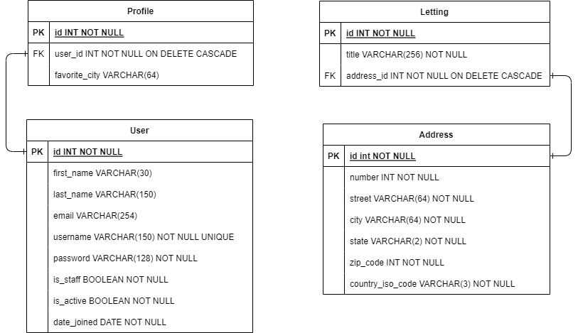

Structure et modèles de la base de données
==========================================

L'application web se base sur quatre modèles principaux qui alimentent la base de données: utilisateur (user), profil (profile), adresse (address) et location (letting). Voici la représentation UML du schéma de la base de données:

